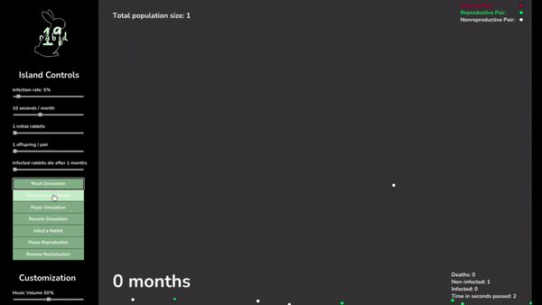

<a href="https://andyngo2021.github.io/helyx-fibonacci-rabbits" target="_blank"><h1 align="center">Fibonacci's Rabbit Simulator</h1></a>

## Welcome to Easter Island! ##
 

 
 

### Rules the Rabbits on Easter Island Abide By ###
1. The population begins in the first month with a pair of newborn rabbits.
2. Rabbits reach reproductive age after one month.
3. In any given month, every rabbit of reproductive age mates with another rabbit of reproductive age.
4. Exactly one month after two rabbits mate, they produce one male and one female rabbit.
5. Rabbits never die or stop reproducing.

 

With these rules in mind, the number of rabbit pairs on the island follow the Fibonacci sequence, where the number of pairs during the nth month represent the nth term of the sequence given that F0 = 1 and  F1 = 1.
 
 

## RABID-19 Virus ##
Uh oh! A virus has made its way onto Easter Island!
 
Simulate a pandemic on Easter Island by infecting the rabbits with RABID-19 and control the rate at which the virus spreads using the sliders at the side!
 
 

 

## Island Customization ##
 
Mix things up and change the size of each rabbit pair or their speed! You can also change the color of the background and rabbits!

 

 
