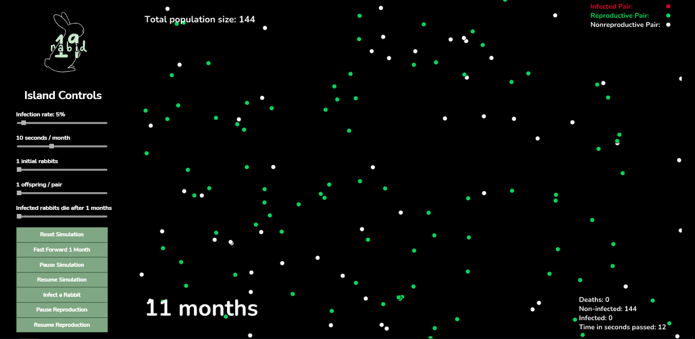
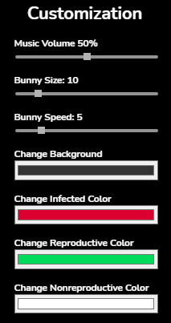

# Fibonacci's Rabbit Simulator #

## Welcome to Easter Island! ##
 

 

### Rules the Rabbits on Easter Island Abide By ###
1. The population begins in the first month with a pair of newborn rabbits.
2. Rabbits reach reproductive age after one month.
3. In any given month, every rabbit of reproductive age mates with another rabbit of reproductive age.
4. Exactly one month after two rabbits mate, they produce one male and one female rabbit.
5. Rabbits never die or stop reproducing.

 

With these rules in mind, the number of rabbit pairs on the island follow the Fibonacci sequence, where the number of pairs during the nth month represent the nth term of the sequence given that F0 = 1 and  F1 = 1.
 
 

## Island Customization ##
 

